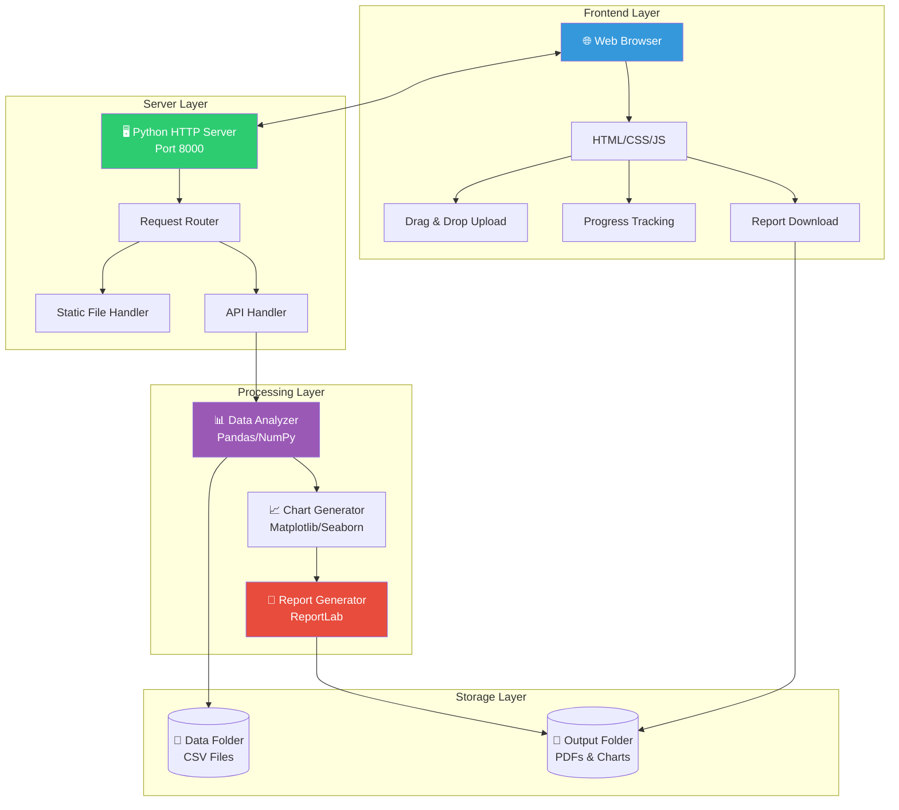
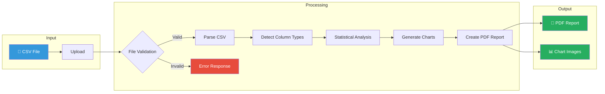
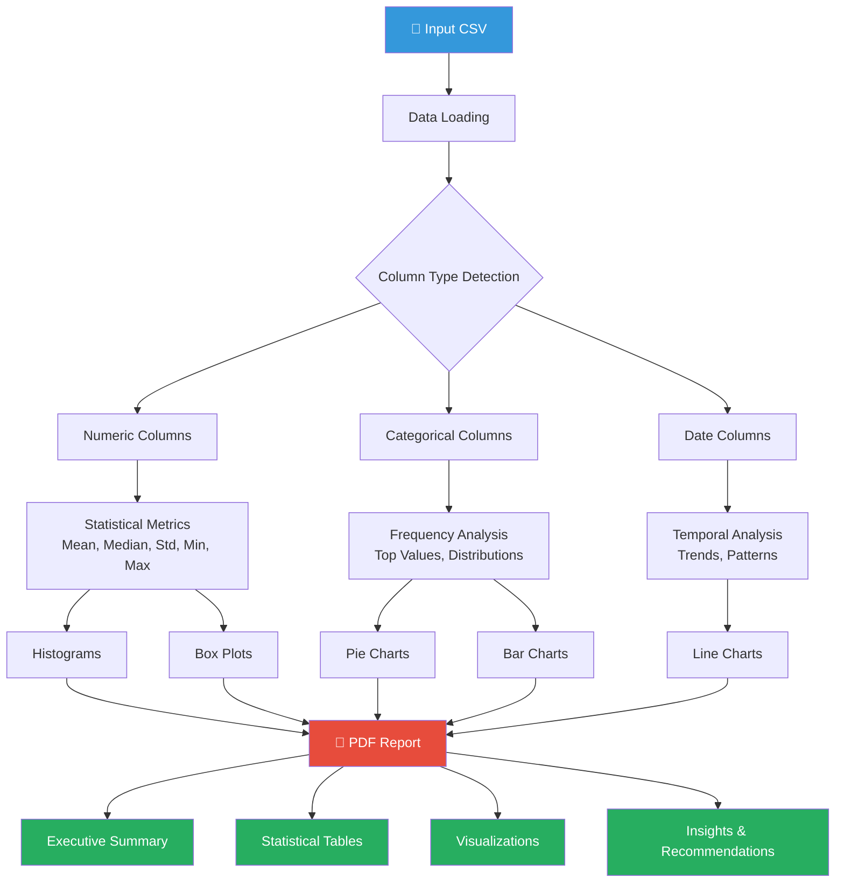
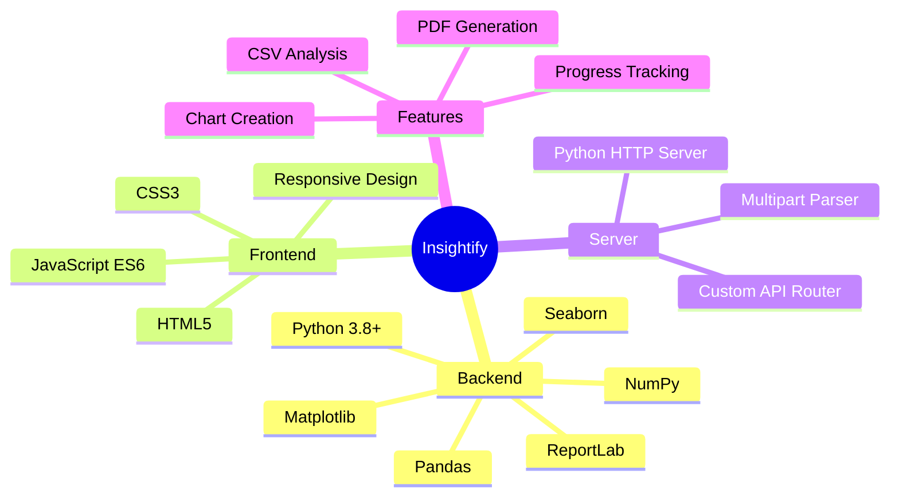
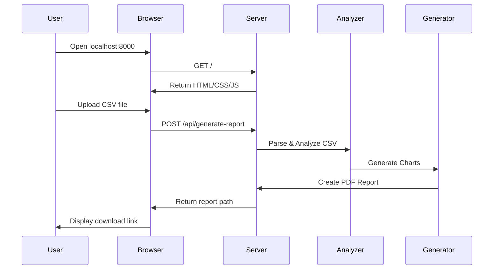
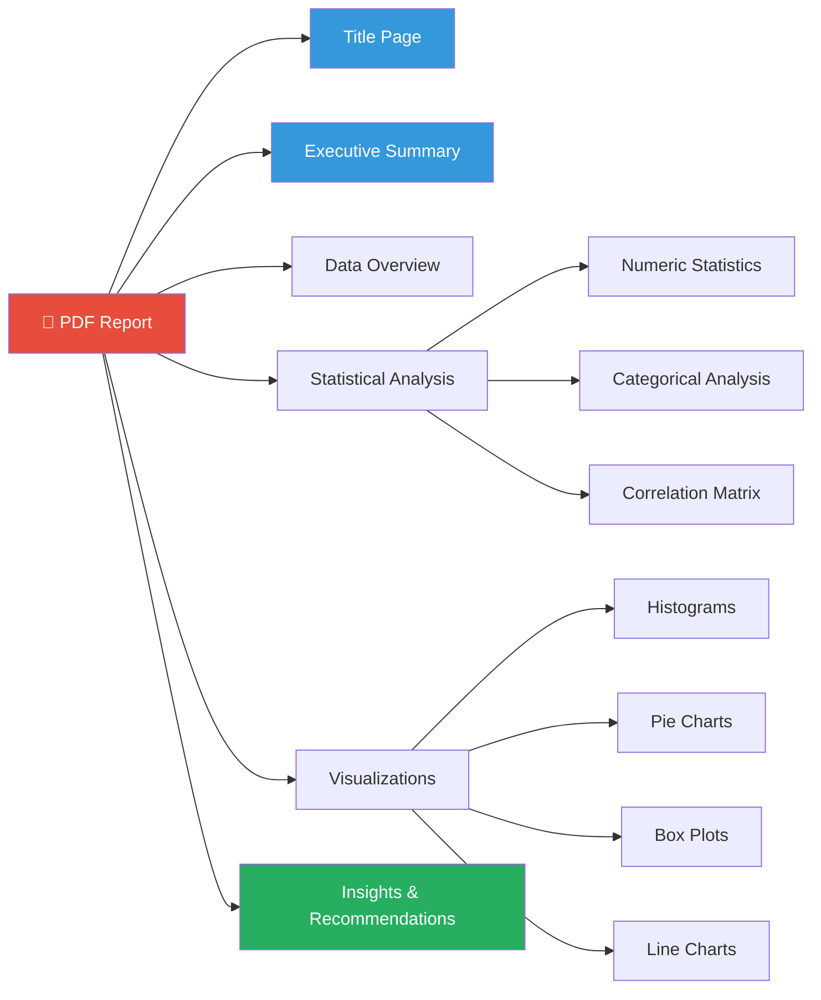
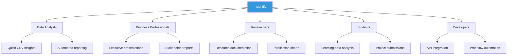

<div align="center">

# 📊 Insightify

### Professional Data Analysis & Report Generation Platform

[](https://python.org)
[](https://pandas.pydata.org)
[](LICENSE)
[]()

**Transform your CSV data into actionable insights with professional PDF reports**

[Features](#-features) • [Installation](#-installation) • [Usage](#-usage) • [Architecture](#-system-architecture) • [Contributing](#-contributing)

---


</div>

---

## 📋 Table of Contents

- [About the Project](#-about-the-project)
- [Features](#-features)
- [System Architecture](#-system-architecture)
- [Data Flow](#-data-flow)
- [Tech Stack](#-tech-stack)
- [Project Structure](#-project-structure)
- [Installation](#-installation)
- [Usage](#-usage)
- [Report Contents](#-report-contents)
- [API Reference](#-api-reference)
- [Mobile Responsiveness](#-mobile-responsiveness)
- [Screenshots](#-screenshots)
- [Use Cases](#-use-cases)
- [Contributing](#-contributing)
- [License](#-license)
- [Acknowledgments](#-acknowledgments)

---

## 🎯 About the Project

**Insightify** is a professional-grade data analysis and report generation platform that transforms raw CSV data into comprehensive, publication-ready PDF reports. Built as part of the **CODTECH IT Solutions Internship Program**, this project demonstrates advanced Python programming, data visualization, and full-stack web development skills.

### 🏢 Internship Details

| Field | Details |
|-------|---------|
| **Company** | CODTECH IT SOLUTIONS |
| **Intern Name** | Aman Shaikh |
| **Intern ID** | CT06DR1460 |
| **Domain** | Python Programming |
| **Duration** | 6 Weeks |
| **Mentor** | Neela Santhosh Kumar |
| **Task** | Task 3 – Dynamic Report Generation & Data Visualization |

---

## ✨ Features

<table>
<tr>
<td width="50%">

### 🔍 **Smart Analysis Engine**
- Universal CSV file support
- Automatic column type detection
- Dynamic statistical analysis
- Correlation matrix generation

</td>
<td width="50%">

### 📊 **Professional Visualizations**
- Histograms & distributions
- Pie charts for categories
- Box plots for outliers
- Line charts for trends

</td>
</tr>
<tr>
<td>

### 📄 **PDF Report Generation**
- Multi-page professional reports
- Executive summaries
- Embedded visualizations
- Actionable insights

</td>
<td>

### 🌐 **Modern Web Interface**
- Responsive design (mobile-first)
- Drag & drop file upload
- Real-time progress tracking
- Recent reports history

</td>
</tr>
</table>

### Key Highlights

- ✅ **Universal Compatibility** – Works with ANY CSV file structure
- ✅ **No Configuration Required** – Automatic column detection
- ✅ **Privacy First** – All processing happens locally
- ✅ **Professional Output** – Publication-ready PDF reports
- ✅ **Mobile Responsive** – Hamburger menu & touch-friendly UI
- ✅ **Fast Processing** – Handles datasets with 1M+ rows

---

## 🏗 System Architecture



---

## 🔄 Data Flow



---

## 📊 Analysis Pipeline



---

## 🛠 Tech Stack



### Detailed Stack

| Layer | Technology | Purpose |
|-------|------------|---------|
| **Backend** | Python 3.8+ | Core programming language |
| | Pandas | Data manipulation & analysis |
| | NumPy | Statistical computations |
| | Matplotlib | Chart generation |
| | Seaborn | Statistical visualizations |
| | ReportLab | PDF document generation |
| **Frontend** | HTML5 | Page structure |
| | CSS3 | Styling & animations |
| | JavaScript | Interactivity & API calls |
| **Server** | http.server | HTTP request handling |
| | Custom Router | API endpoint management |

---

## 📁 Project Structure

```
Insightify/
│
├── 📁 frontend/                    # Web Interface
│   ├── index.html                  # Main application page
│   ├── styles.css                  # Responsive styling (2500+ lines)
│   ├── app.js                      # Frontend logic & API calls
│   ├── logo.png                    # Brand logo/favicon
│   └── favicon.png                 # Browser favicon
│
├── 📁 backend/                     # Core Processing
│   ├── data_analyzer.py            # CSV analysis engine
│   ├── report_generator.py         # PDF generation
│   └── __pycache__/                # Python bytecode cache
│
├── 📁 data/                        # Input Files
│   └── *.csv                       # Uploaded CSV files
│
├── 📁 output/                      # Generated Content
│   ├── *.pdf                       # Generated PDF reports
│   └── charts/                     # Chart images (PNG)
│
├── 📁 .github/                     # GitHub Configuration
│   └── workflows/                  # CI/CD pipelines
│
├── 📄 web_server.py                # Main server application
├── 📄 requirements.txt             # Python dependencies
├── 📄 run_web.bat                  # Windows startup script
├── 📄 demo.png                     # Demo screenshot
└── 📄 README.md                    # Documentation (this file)
```

---

## ⚙ Installation

### Prerequisites

- Python 3.8 or higher
- pip (Python package manager)
- Git (optional, for cloning)

### Step 1: Clone the Repository

```bash
git clone https://github.com/amaanshaikh711/AUTOMATED-REPORT-GENERATION.git
cd AUTOMATED-REPORT-GENERATION
```

### Step 2: Create Virtual Environment (Recommended)

```bash
# Create virtual environment
python -m venv venv

# Activate virtual environment
# On Windows:
venv\Scripts\activate

# On macOS/Linux:
source venv/bin/activate
```

### Step 3: Install Dependencies

```bash
pip install -r requirements.txt
```

Or install packages individually:

```bash
pip install pandas numpy matplotlib seaborn reportlab
```

### Step 4: Run the Application

```bash
python web_server.py
```

### Step 5: Open in Browser

Navigate to: **[http://localhost:8000](http://localhost:8000)**

---

## 🚀 Usage

### Web Interface



### Quick Start Guide

1. **Upload** – Drag & drop or click to select a CSV file
2. **Configure** – Set report title and select chart types
3. **Generate** – Click "Generate Professional Report"
4. **Download** – Open or download the PDF report

### Command Line Interface

```bash
# Basic usage
python generate_report.py data/sales_data.csv

# With options
python generate_report.py data/sales_data.csv \
    -o output/my_report.pdf \
    -t "Sales Analysis Report" \
    -s "Q4 2024 Performance Review"
```

**CLI Options:**

| Option | Description |
|--------|-------------|
| `-o, --output` | Output PDF file path |
| `-c, --charts` | Charts directory path |
| `-t, --title` | Custom report title |
| `-s, --subtitle` | Custom report subtitle |

---

## 📑 Report Contents

Each generated report includes:



### Report Sections

| Section | Description |
|---------|-------------|
| **Title Page** | Professional branding with logo and metadata |
| **Executive Summary** | Dataset overview, key findings summary |
| **Data Overview** | Row/column counts, data types, sample data |
| **Numeric Analysis** | Mean, median, std, min, max for each column |
| **Categorical Analysis** | Top values, frequency distributions |
| **Correlation Analysis** | Relationships between numeric variables |
| **Visualizations** | Charts embedded with explanations |
| **Conclusions** | Automated insights and recommendations |

---

## 🔌 API Reference

### Generate Report Endpoint

```http
POST /api/generate-report
Content-Type: multipart/form-data
```

**Request Body:**

| Parameter | Type | Required | Description |
|-----------|------|----------|-------------|
| `file` | File | Yes | CSV file to analyze |
| `title` | String | No | Custom report title |
| `subtitle` | String | No | Custom report subtitle |
| `includeHistograms` | Boolean | No | Include histogram charts |
| `includePieCharts` | Boolean | No | Include pie charts |
| `includeBoxPlots` | Boolean | No | Include box plots |
| `includeLineCharts` | Boolean | No | Include line charts |

**Response:**

```json
{
    "success": true,
    "report": "/output/report_20241223_120000.pdf",
    "message": "Report generated successfully"
}
```

---

## 📱 Mobile Responsiveness

Insightify features a fully responsive design with:

- **Hamburger Menu** – Slide-in navigation for mobile
- **Touch-Friendly** – Minimum 44px tap targets
- **Adaptive Layout** – Grid changes based on screen size
- **Hero Section** – Text above cube on mobile view

### Breakpoints

| Breakpoint | Target | Features |
|------------|--------|----------|
| `> 1024px` | Desktop | Full navigation, side-by-side layout |
| `768-1024px` | Tablet | Stacked layout, full nav |
| `480-768px` | Mobile Landscape | Hamburger menu, stacked sections |
| `< 480px` | Mobile Portrait | Compact UI, touch optimized |

---

## 📸 Screenshots

<div align="center">

### Desktop View


### Mobile View (Responsive)
*Hamburger menu with slide-in navigation*

</div>

---

## 💼 Use Cases



---

## 🔒 Privacy & Security

| Feature | Description |
|---------|-------------|
| ✅ **Local Processing** | All data processed on your machine |
| ✅ **No Cloud Upload** | Data never sent to external servers |
| ✅ **Temporary Storage** | Files stored locally only |
| ✅ **No Tracking** | No analytics or user tracking |

---

## 🤝 Contributing

Contributions are welcome! Please follow these steps:

1. **Fork** the repository
2. **Create** a feature branch (`git checkout -b feature/AmazingFeature`)
3. **Commit** your changes (`git commit -m 'Add AmazingFeature'`)
4. **Push** to the branch (`git push origin feature/AmazingFeature`)
5. **Open** a Pull Request

---

## 📄 License

This project is part of the **CODTECH IT SOLUTIONS** internship program.

---

## 🙏 Acknowledgments

- **CODTECH IT SOLUTIONS** – For the internship opportunity
- **Neela Santhosh Kumar** – Mentor guidance and support
- **Open Source Community** – For the amazing libraries used

---

<div align="center">

### 👨‍💻 Developer

**Aman Shaikh**  
*Python Developer | Data Analyst*

[](https://github.com/amaanshaikh711)

---

**Made with ❤️ for professional data analysis**

*Transform your data into insights with Insightify*

</div>
