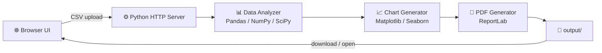

<div align="center">


# Insightify

### Professional Data Analysis & Report Generation Platform

[](https://python.org)
[](https://pandas.pydata.org)
[](LICENSE)
[]()

**Transform your CSV data into actionable insights with professional PDF reports — in seconds.**

[Features](#-features) • [Quick Start](#-quick-start) • [Report Contents](#-report-contents) • [Architecture](#-architecture) • [Project Structure](#-project-structure) • [Contributing](#-contributing)

---


</div>

---

## 📋 Table of Contents

- [About the Project](#-about-the-project)
- [Features](#-features)
- [Quick Start](#-quick-start)
- [Usage](#-usage)
- [Report Contents](#-report-contents)
- [Architecture](#-architecture)
- [Tech Stack](#-tech-stack)
- [Project Structure](#-project-structure)
- [API Reference](#-api-reference)
- [Use Cases](#-use-cases)
- [Privacy & Security](#-privacy--security)
- [Contributing](#-contributing)
- [License](#-license)
- [Acknowledgments](#-acknowledgments)

---

## 🎯 About the Project

**Insightify** is a professional-grade data analysis and report generation platform that transforms raw CSV data into comprehensive, publication-ready PDF reports. Upload any CSV, configure the visualizations you want, and receive a polished multi-page report with statistics, charts, correlations, and automated insights — all processed locally on your machine.

Built as part of the **CODTECH IT Solutions Internship Program** (Task 3 — Dynamic Report Generation & Data Visualization).

### Why Insightify?

| | |
|---|---|
| 🧠 **Zero configuration** | Automatic column-type detection works with **any** CSV structure |
| ⚡ **Fast** | Handles datasets from a few rows to millions, with robust edge-case handling |
| 📄 **Presentation-ready** | Multi-page branded PDFs with executive summary, tables & visualizations |
| 🔒 **Private** | 100% local processing — your data never leaves your machine |

---

## ✨ Features

### 🔍 Smart Analysis Engine
- Universal CSV file support with automatic column type detection (numeric / categorical / temporal)
- Comprehensive statistics: mean, median, std, quartiles, skewness, kurtosis
- Correlation matrix with strength & direction classification
- Data quality checks: missing values, duplicate rows, memory footprint
- Automated, data-driven insights generated from your actual data

### 📊 Professional Visualizations
- Histograms with KDE density curves and statistics boxes
- Stock-market-style line charts with moving averages, mean & median markers
- Horizontal bar charts for categorical distributions
- Pie charts for category breakdowns
- Correlation heatmaps and scatter plots with trend lines
- Monthly trend lines for temporal data
- Configurable chart types — include only what you need

### 📄 PDF Report Generation
- Multi-page professional reports with branded title page
- Executive summary & key insights
- Statistical tables for numeric and categorical columns
- Embedded visualizations with explanations
- Conclusions & actionable recommendations

### 🌐 Modern Web Interface
- Responsive, mobile-first design with hamburger navigation
- Drag & drop file upload with real-time progress tracking
- Chart-type configuration before generation
- Recent-reports history with one-click open/download

### 🛡 Robustness Highlights
- Skips KDE curves gracefully on constant/low-variance data
- Drops empty `Unnamed:` columns caused by stray CSV commas
- Safe date parsing (no more two-digit-year misreads)
- Handles empty columns, NaN pairs, and single-category data without crashing

---

## 🚀 Quick Start

### Prerequisites
- Python 3.8+

### Installation

```bash
# 1. Clone the repository
git clone https://github.com/amaanshaikh711/Insightify-.git
cd Insightify-

# 2. (Recommended) Create a virtual environment
python -m venv venv
venv\Scripts\activate        # Windows
# source venv/bin/activate   # macOS/Linux

# 3. Install dependencies
pip install -r requirements.txt

# 4. Run the web server
python web_server.py
```

Open **http://localhost:8000** and start analyzing. 🎉

> **Windows one-click:** double-click `run_web.bat` — it checks Python, installs dependencies, starts the server and opens your browser.

### Optional: Streamlit UI

```bash
streamlit run app_streamlit.py
```

### Optional: CLI-style generation

```bash
python test_enhanced_reports.py   # end-to-end pipeline demo using a sample CSV
```

---

## 📖 Usage

1. **Upload** — drag & drop or click to select a CSV file
2. **Configure** — set the report title/subtitle and toggle chart types (histograms, pie charts, box plots, line charts)
3. **Generate** — click **Generate Professional Report** and watch live progress
4. **Review** — open the PDF in the browser or download it

---

## 📑 Report Contents

| Section | Description |
|---------|-------------|
| **Title Page** | Branded cover with report metadata |
| **Executive Summary** | Dataset overview, composition, quality metrics |
| **Key Insights** | Automated, data-driven findings |
| **Numeric Analysis** | Mean, median, std, min/max, IQR per column |
| **Categorical Analysis** | Top values, frequencies, concentration |
| **Correlation Analysis** | Ranked relationships with strength & direction |
| **Visualizations** | All configured charts, embedded with captions |
| **Conclusions** | Findings summary & actionable recommendations |

---

## 🏗 Architecture



**Pipeline:** Upload → parse multipart form → `DataAnalyzer` (statistics, correlations, insights) → chart generation with your configuration → `PDFReportGenerator` builds the document → served back at `/output/report_<timestamp>.pdf`.

---

## 🛠 Tech Stack

| Layer | Technology | Purpose |
|-------|------------|---------|
| **Backend** | Python 3.8+ | Core application |
| | Pandas, NumPy | Data manipulation & statistics |
| | SciPy | KDE density estimation |
| | Matplotlib, Seaborn | Visualization engine |
| | ReportLab | PDF document generation |
| **Server** | `http.server` (threaded) | Zero-dependency web server & API |
| **Frontend** | HTML5, CSS3, JavaScript | Responsive single-page UI |

---

## 📁 Project Structure

```
Insightify/
├── frontend/                 # Web interface
│   ├── index.html            # Main page
│   ├── styles.css            # Responsive styling
│   ├── app.js                # Upload & progress logic
│   ├── logo-full.png         # Full brand lockup
│   └── logo.png              # Icon (also used as favicon)
├── backend/
│   ├── data_analyzer.py      # Analysis & chart engine
│   └── report_generator.py   # PDF report builder
├── data/                     # Seed CSVs (uploads are gitignored)
├── output/                   # Generated reports & charts (gitignored)
├── web_server.py             # HTTP server + API
├── app_streamlit.py          # Alternative Streamlit UI
├── run_web.bat               # Windows launcher
└── requirements.txt
```

---

## 🔌 API Reference

### Generate Report

```http
POST /api/generate-report
Content-Type: multipart/form-data
```

| Parameter | Type | Required | Description |
|-----------|------|----------|-------------|
| `file` | File | ✅ | CSV file to analyze |
| `title` | String | ❌ | Custom report title |
| `subtitle` | String | ❌ | Custom report subtitle |
| `includeHistograms` | Boolean | ❌ | Include histogram charts (default `true`) |
| `includePieCharts` | Boolean | ❌ | Include pie charts (default `true`) |
| `includeBoxPlots` | Boolean | ❌ | Include box plots (default `true`) |
| `includeLineCharts` | Boolean | ❌ | Include line charts (default `true`) |

**Response**

```json
{
  "success": true,
  "report": "/output/report_20260913_120000.pdf",
  "charts": "/output/charts_20260913_120000",
  "message": "Report generated successfully"
}
```

---

## 💼 Use Cases

- **Data Analysts** — instant EDA reports for stakeholders
- **Business Teams** — executive-ready summaries of sales/ops data
- **Researchers & Students** — documented statistical analysis for projects
- **Developers** — a clean, hackable Python reporting pipeline

---

## 🔒 Privacy & Security

| ✅ | |
|---|---|
| **Local processing** | All analysis runs on your machine |
| **No cloud upload** | Data is never sent to external servers |
| **No tracking** | Zero analytics or telemetry |

---

## 🤝 Contributing

Contributions are welcome!

1. Fork the repository
2. Create a feature branch (`git checkout -b feature/AmazingFeature`)
3. Commit your changes (`git commit -m 'Add some AmazingFeature'`)
4. Push to the branch (`git push origin feature/AmazingFeature`)
5. Open a Pull Request

---

## 📄 License

This project is licensed under the MIT License — see the [LICENSE](LICENSE) file for details.

---

## 🙏 Acknowledgments

- **CODTECH IT SOLUTIONS** — internship opportunity & mentorship
- **Neela Santhosh Kumar** — mentor guidance
- The open-source Python data community

---

<div align="center">

**Insightify** — Transform your data into insights.

*Built with ❤️ by [Aman Shaikh](https://github.com/amaanshaikh711)*

</div>
